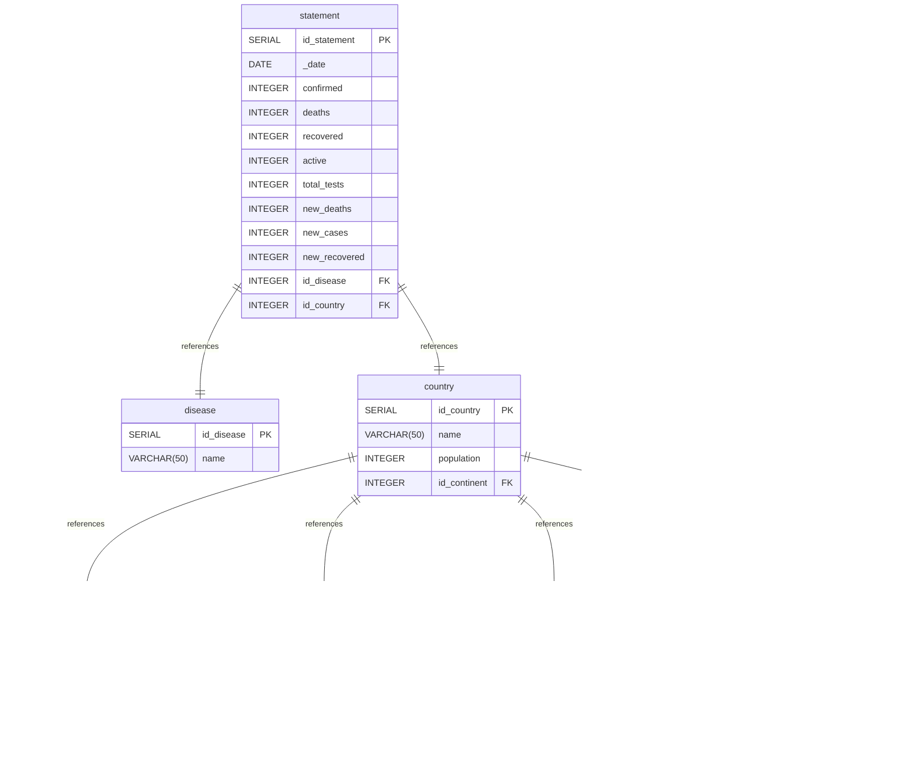

```mermaid
erDiagram
    disease {
        SERIAL id_disease PK
        VARCHAR(50) name
    }

    statement {
        SERIAL id_statement PK
        DATE _date
        INTEGER confirmed
        INTEGER deaths
        INTEGER recovered
        INTEGER active
        INTEGER total_tests
        INTEGER new_deaths
        INTEGER new_cases
        INTEGER new_recovered
        INTEGER id_disease FK
        INTEGER id_country FK
    }
    statement ||--|| disease : "references"
    statement ||--|| country : "references"

    region {
        SERIAL id_region PK
        VARCHAR(50) name
        INTEGER population
    }

    continent {
        SERIAL id_continent PK
        VARCHAR(50) name
    }

    country {
        SERIAL id_country PK
        VARCHAR(50) name
        INTEGER population
        INTEGER id_continent FK
    }
    country ||--|| continent : "references"
    country ||--|| region : "references"
    country ||--|| climat_type : "references"
    country ||--|| weather_report : "references"

    climat_type {
        SERIAL id_climat_type PK
        STRING name
        STRING description
    }

    weather_report {
        SERAIL id_weather_report PK
        DATETIME date_start
        DATETIME date_end
        FLOAT average_temperature
        FLOAT average_wind_velocity
        FLOAT humidity_level
        INTEGER id_country FK
    }
```