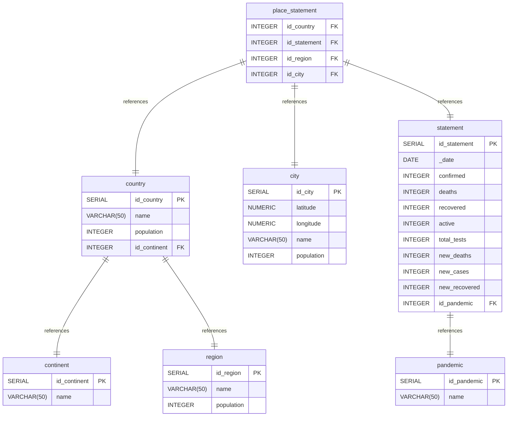

```mermaid
erDiagram
    pandemic {
        SERIAL id_pandemic PK
        VARCHAR(50) name
    }

    statement {
        SERIAL id_statement PK
        DATE _date
        INTEGER confirmed
        INTEGER deaths
        INTEGER recovered
        INTEGER active
        INTEGER total_tests
        INTEGER new_deaths
        INTEGER new_cases
        INTEGER new_recovered
        INTEGER id_pandemic FK
    }
    statement ||--|| pandemic : "references"

    region {
        SERIAL id_region PK
        VARCHAR(50) name
        INTEGER population
    }

    city {
        SERIAL id_city PK
        NUMERIC latitude
        NUMERIC longitude
        VARCHAR(50) name
        INTEGER population
    }

    continent {
        SERIAL id_continent PK
        VARCHAR(50) name
    }

    country {
        SERIAL id_country PK
        VARCHAR(50) name
        INTEGER population
        INTEGER id_continent FK
    }
    country ||--|| continent : "references"
    country ||--|| region : "references"

    place_statement {
        INTEGER id_country FK
        INTEGER id_statement FK
        INTEGER id_region FK
        INTEGER id_city FK
    }
    place_statement ||--|| country : "references"
    place_statement ||--|| statement : "references"
    place_statement ||--|| city : "references"
```